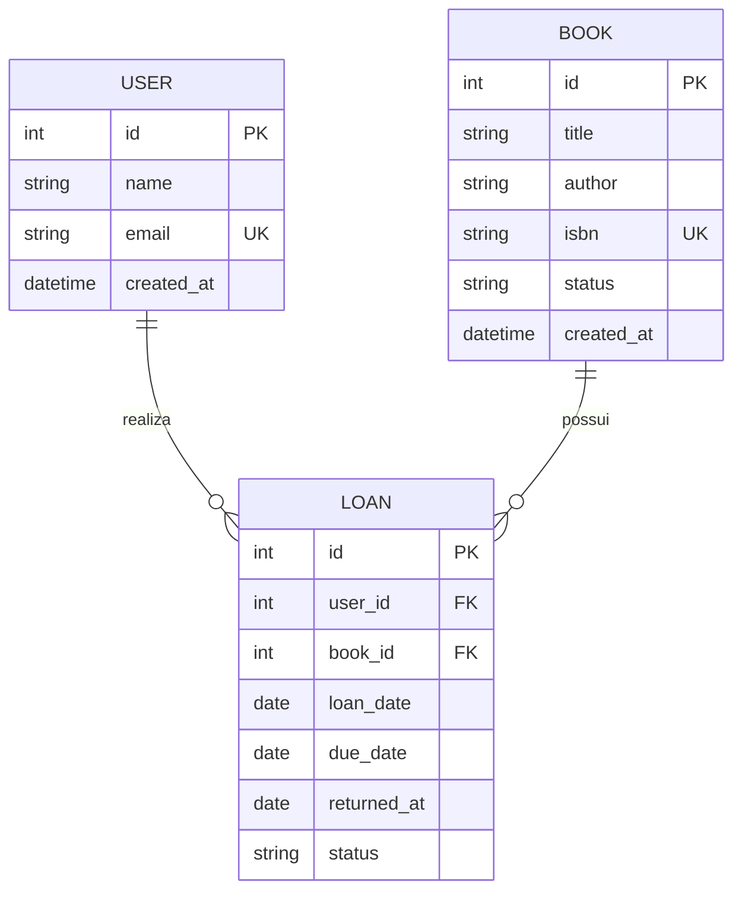

<div align="center">

# 📚 Sistema de Gerenciamento de Biblioteca

Projeto referente ao **Processo Trainee da Comp Júnior**.

</div>

---

## Sobre o projeto

O sistema tem como objetivo organizar o cadastro de usuários e livros, além de registrar e acompanhar os empréstimos realizados. A proposta é oferecer uma experiência de gerenciamento mais organizada, clara e intuitiva, permitindo identificar quem retirou um livro, qual obra foi emprestada e a situação atual do empréstimo.

> **Propósito:** apoiar o controle da circulação dos livros, mantendo o catálogo, os usuários responsáveis e o histórico das movimentações em uma estrutura centralizada e coerente.

### Visão geral

| Recurso | Responsabilidade no sistema |
| --- | --- |
| 👤 **Usuários** | Representar as pessoas que podem realizar empréstimos |
| 📖 **Livros** | Manter as informações e a disponibilidade das obras |
| 🔄 **Empréstimos** | Registrar a circulação dos livros entre a biblioteca e os usuários |

## Navegação

- [Modelagem inicial](#modelagem-inicial)
- [Relacionamentos](#relacionamentos)
- [DER inicial](#der-inicial)

## Modelagem inicial

<details open>
<summary><strong>User</strong> — usuário da biblioteca</summary>

Representa uma pessoa cadastrada na biblioteca que pode realizar empréstimos.

| Atributo | Descrição |
| --- | --- |
| `id` | Identificador único do usuário |
| `name` | Nome do usuário |
| `email` | E-mail do usuário |
| `created_at` | Data de criação do cadastro |

</details>

<details open>
<summary><strong>Book</strong> — livro do catálogo</summary>

Representa um livro disponível no catálogo da biblioteca.

| Atributo | Descrição |
| --- | --- |
| `id` | Identificador único do livro |
| `title` | Título do livro |
| `author` | Autor do livro |
| `isbn` | Código ISBN do livro |
| `status` | Situação atual do livro |
| `created_at` | Data de criação do cadastro |

</details>

<details open>
<summary><strong>Loan</strong> — empréstimo realizado</summary>

Representa o empréstimo de um livro para um usuário.

| Atributo | Descrição |
| --- | --- |
| `id` | Identificador único do empréstimo |
| `user_id` | Referência ao usuário responsável |
| `book_id` | Referência ao livro emprestado |
| `loan_date` | Data de realização do empréstimo |
| `due_date` | Data prevista para devolução |
| `returned_at` | Data em que o livro foi devolvido |
| `status` | Situação atual do empréstimo |

</details>

## Relacionamentos

```text
User  1 ─────────── N  Loan  N ─────────── 1  Book
          realiza                         registra
```

- Um `User` pode possuir vários `Loan` ao longo do tempo.
- Um `Book` pode aparecer em vários `Loan` ao longo do tempo.
- Cada `Loan` pertence a exatamente um `User` e a exatamente um `Book`.
- Um `Book` pode possuir somente um empréstimo ativo por vez.

## DER inicial


